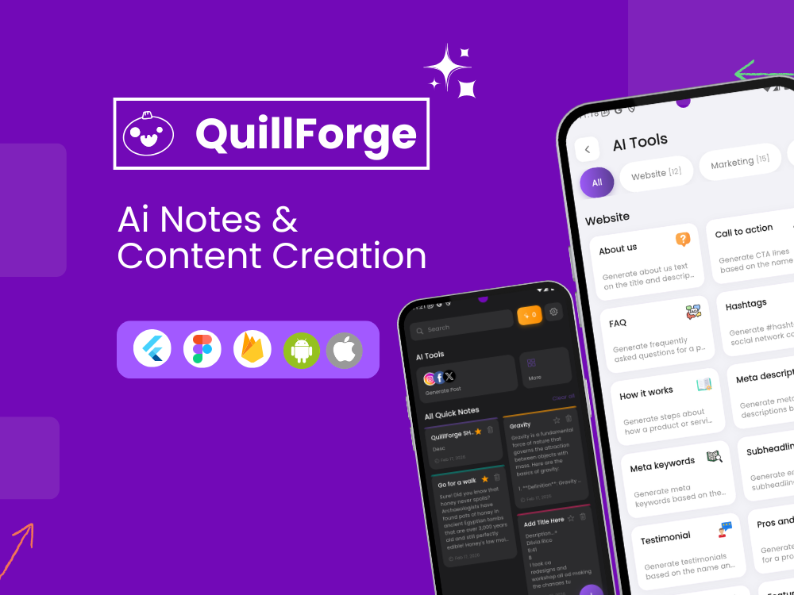
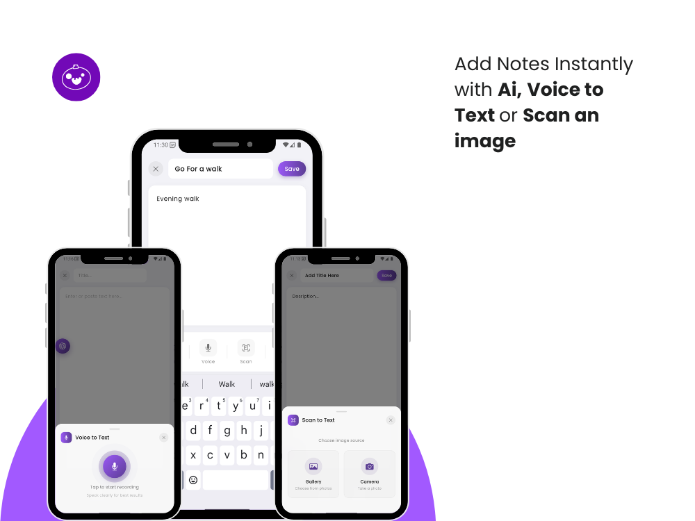
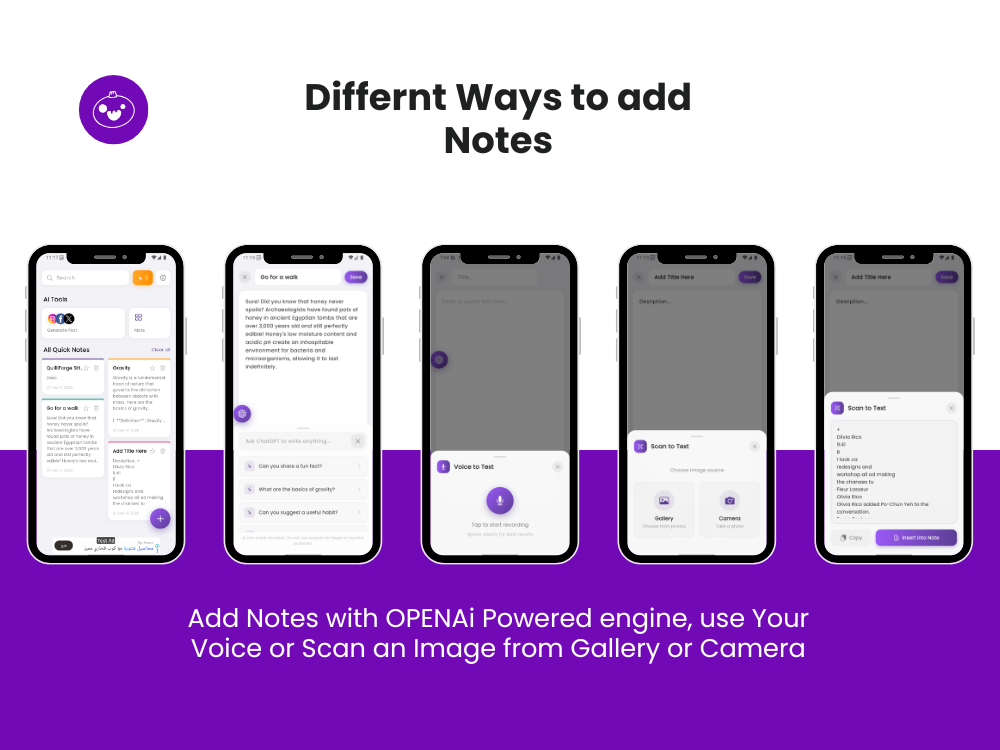
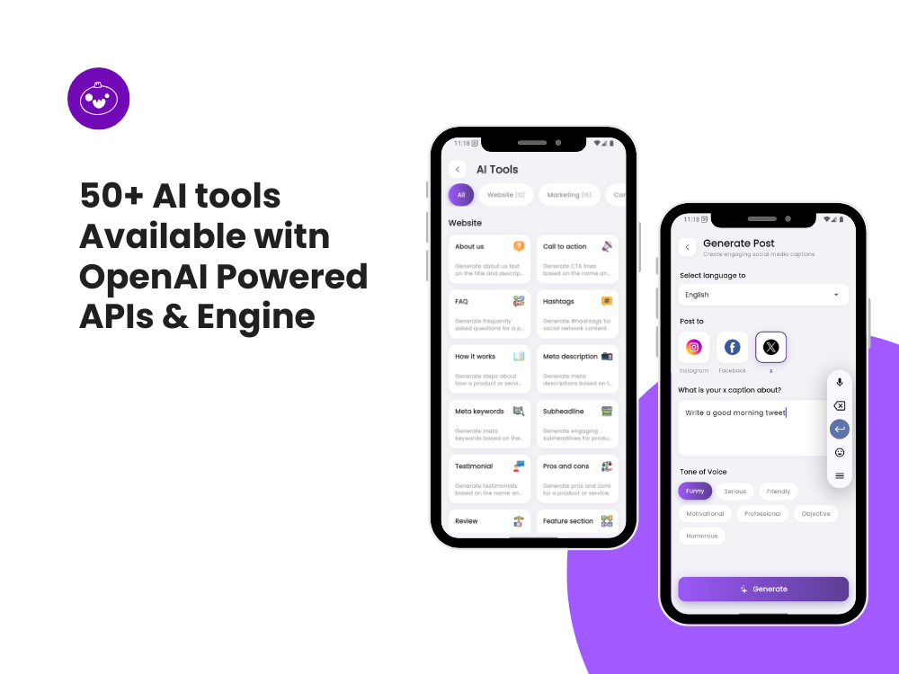
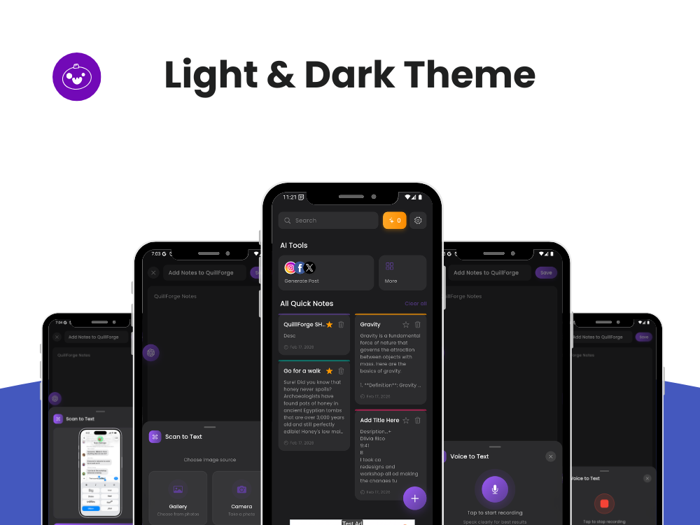
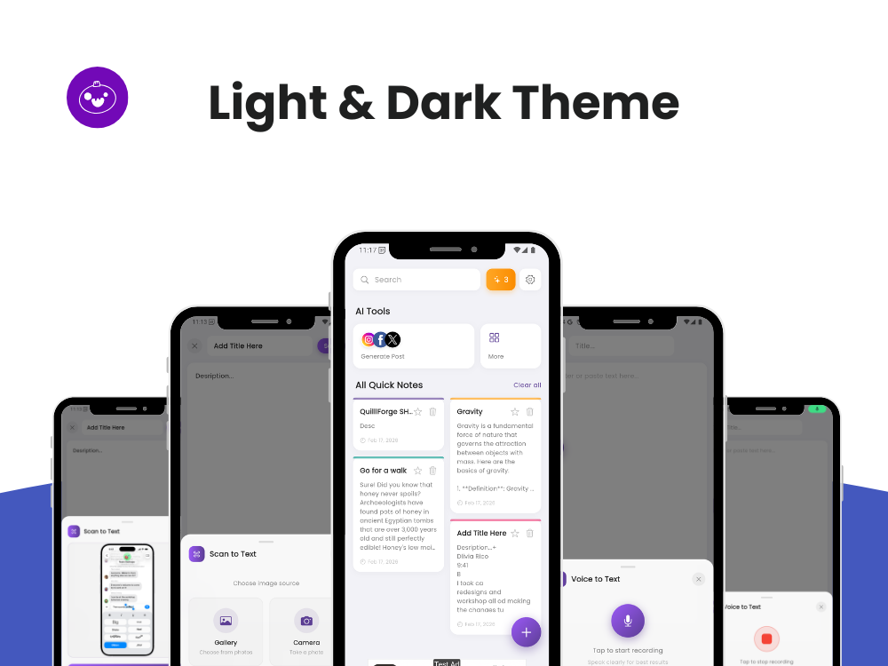

# QuillForge: AI Notes & Content

QuillForge is a cross-platform AI-powered productivity application built with Flutter for Android
and iOS. It combines intelligent note-taking with a rich library of AI tools for writing, content
creation, marketing, and daily productivity. The project is designed for production use with clear
monetization boundaries, optimized AI usage, and a scalable modular architecture.

---

## Overview

QuillForge enables users to:

- Create, edit, organize, and favorite AI-generated notes
- Convert audio recordings and images into editable text
- Generate ready-to-publish content for social platforms
- Use 50+ specialized AI tools across writing, marketing, business, and creativity
- Access free and premium tiers with clear feature separation
- Experience a performant, offline-first mobile app with cloud sync

The app follows a strict free vs premium model, where advanced AI models, higher limits, and ad-free
usage are reserved for subscribers.

---

## Tech Stack

- **Framework**: Flutter 3.x (Dart)
- **Architecture**: GetX (state management, routing, dependency injection)
- **Local Storage**: SQLite
- **Secure Storage**: flutter_secure_storage
- **AI Providers**: OpenAI (text, vision, speech-to-text), Claude (optional)
- **Analytics & Stability**: Firebase Analytics, Crashlytics
- **Authentication & Sync**: Firebase Authentication, Firestore
- **Monetization**:
    - Google AdMob (banner, interstitial, rewarded)
    - In-app subscriptions (RevenueCat or equivalent)

---

## Core Features

### AI Notes

- Quick Notes using lightweight models for fast generation
- Advanced Notes using higher-quality models (premium only)
- AI-assisted editing (rewrite, expand, summarize)
- Folder organization, search, favorites, and export

### Voice & Image to Text

- Audio-to-text transcription
- Image OCR and understanding
- Outputs saved as fully editable notes

### Social Media Generation

- Instagram, Facebook, X, LinkedIn, TikTok
- Configurable tone, length, hashtags, and emojis
- Save to notes or copy/share instantly

### AI Tools Library

- 50+ deterministic AI tools
- Categorized by writing, marketing, business, creative, and productivity
- One-shot generation with reusable outputs

---

## Monetization Model

**Free Tier**

- Limited daily AI requests
- Ads enabled (AdMob)
- Restricted access to advanced models

**Premium Subscription**

- Higher or unlimited AI usage
- Access to advanced AI models
- Fully ad-free experience
- Priority feature access

Subscription state directly controls UI and business logic.

---

## Project Structure

The project follows a strict modular GetX layout.

lib/
├── app/
│ ├── common/ # constants, widgets, utilities
│ ├── modules/ # feature modules (view, controller, binding)
│ ├── routes/ # app routing
│ ├── sql/ # local database helpers
│ ├── theme/ # theme management
│ └── Pref/ # shared preferences
└── main.dart

- **Controllers**: business logic, API calls, state
- **Views**: UI only
- **Bindings**: dependency injection
- **Widgets**: reusable UI components

Architectural consistency is mandatory.

---

## AI & Security Notes

- API keys are **not** hardcoded in widgets or controllers
- Keys are stored using secure storage and runtime assembly
- AI requests are centralized in a dedicated service layer
- Client-side security is risk-mitigated, not zero-risk
- Usage limits, throttling, and premium checks are enforced in logic

Firebase Functions are intentionally not used.

---

## Development Workflow

- `master`: stable, release-ready code
- `development`: active development branch
- Feature work should be done on `development` and merged after validation

Before committing:

- Ensure no secrets are committed
- Verify free vs premium boundaries
- Test loading, error, and offline states

---

## Requirements

- Flutter SDK 3.x
- Android 8.0+ / iOS 13+
- Valid API keys and service accounts
- Firebase project configured (Auth, Firestore, Analytics)

---

## Status

This repository contains the active development codebase for QuillForge. Features are implemented
incrementally with a focus on performance, cost control, and production stability.

---

## License

Proprietary. All rights reserved.
